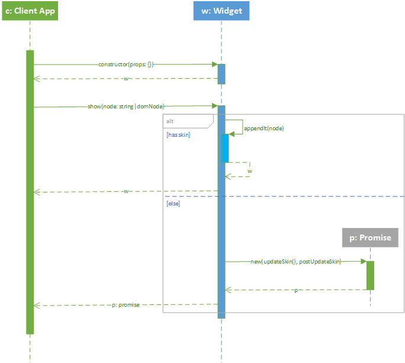

# UI Components #
Here you have the main UI-related components and its interactions.

## Summary ##
- `css`: Components used to handle CSS files
- `Editor`: Extensions to `Editor` compoment
- `logic`: *TBD*
- `menu`: Components used to work with menu options
- `Skins`: *TBD*
- `utils`: Utilities to used to handle DOM elements

## 1. `ComboButton` ##
*TBD*
## 2. `Editor` ##
*TBD*
## 3. `Skin` ##
*TBD*
## 4. `TransitionPanel` ##
*TBD*
## 5. `Widget` ##
A widget is an UI component that can be attached to a parent node/component and can have child widgets as well.

This component extends `Properties` so you can have all features of this module as well. 

Widgets are event aware and have a simple life cycle: Basically after construction you need to cal `show()` method in order to have the `domNode`. `show()` then calls `updateSkin()` and the later calls `onUpdatedSkin()`. This last method is where you can put all logic that requires the `domNode` to be present (i.e.: attach child widgets, or register event handlers).

When you are done with the widget you can call `destroy()` and it will detach all children and call destroy on each one. Also all event handlers are removed from the widget DOM.
  
### `show()` Activity Diagram ###

#### `appendIt(parentNode)` Activity Diagram ####

#### `postUpdateSkin()` Activity Diagram ####

#### Sample Widget: `AccountInfo` ####
Assumes that you need a Widget to capture/edit data related to some Account. You have the following data items Company Name (companyName), Account Responsible/holder (holderName), and Account Type (type). First of all you need to define an Skin with your markup and corresponding Attach Points and / or variables substitutions or Live Expressions (refer to `nineplate` to better understand this features). 

The context of this example assumes that you have an skin (`skin/AccountInfo`) and that this skin is wired up to place the values of all data items.

    :::javascript
    define(['ninejs/core/extend', 'ninejs/ui/Widget', './skin/AccountInfo', './services/someService', 'dojo/on'], function (extend, Widget, defaultSkin, someService, on) {
    	'use strict';
    	var AccountInfoWidget = extend(Widget, {
    		skin: defaultSkin,
    		/**
    		 * Remember here we already have domNode so we can: Add child, connect event to handlers and any other operation that requires the component to exists on the DOM tree.
    		 * @return {undefined}
    		 */
    		onUpdatedSkin: function () {
    			var self = this;
    
    			/** [btClickHandler description] */
    			function btClickHandler (/*evt*/) {
    				if (self.validate() === true) {
    					self.postAccountData();
    				}
    			}
    
    			/** Add a handler to the onClick event for okButton and register it on this widged. Later all events registered with own will be removed when distroy is called */
    			this.own(on(this.okButton, 'click', btClickHandler));
    
    			/** Call some service (maybe server side) and fetch required data. */
    			someService.getAccountInfo().then(function(data) {
    				if (!data) {
    					return;
    				}
    				/** Use Properties features to set/update properties */
    				self.set('account', data);
    			});
    		},
    		/**
    		 * Dummy validation function.
    		 * @return {boolean} true if everything is OK
    		 */
    		validate: function () {
    			this.counter = (this.counter || 0);
    			var valid = (this.counter % 3) === 0;
    			this.counter += 1;
    			return valid;
    		},
    		/**
    		 * Calls the corresponding service and check response.
    		 * @return {undefined}
    		 */
    		postAccountData: function () {
    			someService.updateAccountInfo(this.account).then(function(response) {
    				//Check response and inform results...
    				console.log('Response from server: ' + response);
    			});
    		}
    	}, function() {
    		/**
    		 * Extending the "constructor" setting default values for properties
    		 * @type {Object}
    		 */
    		extend.mixin(this, {
    			account: { companyName: '', holderName: '', type: 'Unknown' }
    		});
    	});
    
    	return AccountInfoWidget;
    });

## 6. `Wizard` ##
*TBD*